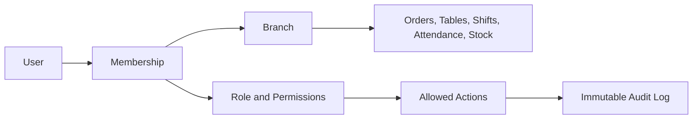
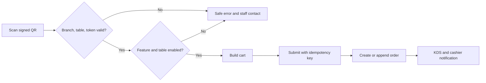

# Blueprint Optimasi Workflow POS Multi-Cabang

Dokumen ini adalah pedoman implementasi dan acceptance test untuk login, self-order, absensi, jadwal staf, shift kasir, dan isolasi data antar-outlet. Status **UI/prototipe** berarti alur sudah dapat didemonstrasikan, tetapi belum aman untuk produksi sebelum tersedia backend, database, dan audit log server-side.

## Sasaran

- Setiap transaksi, meja, shift, absensi, stok, dan staf memiliki `branchId` eksplisit.
- Staf hanya dapat masuk ke outlet dan portal sesuai penugasan.
- Self-order memvalidasi outlet, meja, status fitur, serta hubungan order.
- Absensi memvalidasi staf, jadwal personal, PIN, lokasi outlet, dan selfie sesuai kebijakan.
- Owner dapat melihat lintas cabang; pengguna operasional hanya melihat outlet aktif.

## Ringkasan audit

| Area | Temuan awal | Perbaikan prototipe | Kebutuhan produksi |
|---|---|---|---|
| Login/PIN | PIN ditampilkan, bypass, tanpa lockout | PIN dimasking, bypass dihapus, akun difilter outlet/role, lockout lokal | Hash Argon2id/bcrypt di server, session expiry, revoke device, audit login |
| Multi-cabang | Nomor meja/tampilan tidak terisolasi outlet | Mutasi meja memakai `branchId`; POS, KDS, absensi, stok, laporan difilter outlet | Row-level authorization dan tes kebocoran lintas cabang |
| Self-order | Toggle tidak persisten, cabang hardcoded | Toggle persisten, QR membawa cabang, meja divalidasi, order menyimpan sumber/cabang | Signed QR, expiry, idempotency, rate limit, validasi server |
| Absensi | GPS hanya label statis | Toggle fitur, PIN, selfie, radius GPS per outlet, jadwal personal, toleransi telat | Anti-spoofing, approval koreksi, penyimpanan/retensi bukti aman |
| Jadwal | Hanya per role | Mulai/selesai, status aktif, outlet dapat diedit per staf | Kalender mingguan, shift malam, cuti, tukar shift, approval |
| Shift | Tidak mencatat outlet/jadwal | Shift baru membawa outlet, staf, dan jadwal | Shift aktif per outlet/perangkat, handover, approval selisih kas |
| Storage | PIN/data bisnis di localStorage | Migrasi dan validasi UI | Backend wajib; browser hanya menyimpan cache non-rahasia |

## Arsitektur otorisasi target

Peran target: `SUPER_OWNER` lintas organisasi, `OWNER` pemilik outlet, `MANAGER` operasional dan approval, `ADMIN` master data terbatas, `KASIR` POS/shift sendiri, serta `KITCHEN` KDS tanpa akses keuangan sensitif. Izin wajib diperiksa pada UI dan kembali pada server.

## Workflow login aman

1. Pilih outlet atau gunakan perangkat yang telah dipasangkan ke outlet.
2. Tampilkan hanya staf aktif yang ditugaskan ke outlet.
3. Terima PIN tanpa contoh atau bocoran nilainya.
4. Server memverifikasi hash, menghitung kegagalan, dan menerapkan lockout.
5. Session membawa user, organisasi, outlet aktif, permission, expiry, dan device ID.
6. Perpindahan outlet/portal sensitif meminta autentikasi ulang.

Acceptance criteria:

- Pesan PIN salah tidak mengungkap bagian kredensial yang benar.
- Akun nonaktif/tanpa akses outlet ditolak.
- Lima kegagalan mengunci sementara sesuai kebijakan.
- Refresh tidak dapat memperluas role atau cabang pengguna.

## Workflow self-order

Acceptance criteria:

- URL wajib membawa outlet dan meja; meja harus dimiliki outlet itu.
- Tolak fitur/meja nonaktif, token kedaluwarsa, dan cabang termanipulasi.
- Klik ganda tidak membuat order duplikat.
- Order menyimpan `source=SELF_ORDER`, `branchId`, meja, dan `parentOrderId` bila menambah order aktif.
- Harga, pajak, ketersediaan, dan total dihitung ulang server-side.

## Workflow absensi dan jadwal

1. Owner mengaktifkan fitur dan kebijakan GPS/selfie.
2. Manager menetapkan outlet, hari kerja, mulai/selesai, serta toleransi tiap staf.
3. Sistem menentukan aksi berikutnya dari riwayat; staf tidak bebas memilih masuk/keluar.
4. Verifikasi PIN, selfie baru, lalu GPS terhadap outlet aktif.
5. Hitung keterlambatan dari jadwal efektif dan simpan bukti verifikasi.
6. Koreksi dibuat sebagai request + approval, tidak menimpa record asli.

Acceptance criteria:

- Cabang tanpa koordinat gagal aman saat GPS diwajibkan.
- Staf cabang A tidak muncul di terminal B kecuali ditugaskan ke keduanya.
- `CLOCK_OUT` tidak dapat dibuat sebelum `CLOCK_IN`; shift lintas malam ditangani eksplisit.
- Bukti foto memiliki retensi dan akses terbatas.

## Workflow shift kasir

- Buka shift mengikat staf, outlet, perangkat, jadwal, dan saldo awal.
- Cegah dua shift terbuka yang bertabrakan untuk staf/perangkat.
- Order hanya menambah metrik shift dengan outlet dan `shiftId` yang sama.
- Tutup shift mencatat kas aktual, selisih, alasan, dan approval ambang.
- Handover mencatat staf asal/tujuan tanpa menghapus jejak transaksi.

## Kontrak data minimum

Semua entitas operasional membutuhkan `organizationId`, `branchId`, `createdAt`, `updatedAt`, dan actor. Tambahan penting:

- Membership: `userId`, `branchIds`, `roleId`, `isActive`, `pinHash`.
- Device: `deviceId`, `branchId`, `trustedAt`, `revokedAt`.
- Schedule: staf, outlet, tanggal/hari, mulai, selesai, zona waktu, status.
- Attendance: jadwal efektif, waktu aktual, GPS/akurasi, selfie object key, method, approval trail.
- Self-order session: token hash, outlet/meja, expiry, aktivitas terakhir, revoked state.
- Audit event: actor, outlet, action, target, before/after teredaksi, request/device ID.

## Backlog implementasi

### P0 — sebelum pilot transaksi nyata

- Backend auth; pindahkan PIN dari localStorage ke hash server-side.
- Middleware organisasi/outlet/permission pada seluruh endpoint.
- Session expiry, logout/revoke perangkat, lockout terpusat, audit login.
- Signed QR, expiry, idempotency, dan kalkulasi harga server-side.
- Order/pembayaran transaksional serta audit void/refund.
- Tes otomatis isolasi outlet untuk semua entitas.

### P1 — kesiapan operasional multi-cabang

- Kalender jadwal per staf: mingguan, shift malam, cuti, tukar shift, approval.
- Penyimpanan multi-shift per outlet dan pencegahan overlap.
- GPS/radius/selfie per outlet serta koreksi absensi.
- Pairing terminal ke outlet dan re-authentication saat berpindah konteks.
- Offline sync dengan conflict strategy, retry idempotent, dan indikator pending.
- Dashboard readiness outlet: staf, printer, QR, GPS, meja, pembayaran, stok.

### P2 — skala dan penyempurnaan

- SSO/MFA owner/admin; PIN hanya pada terminal tepercaya.
- Deteksi anomali absensi/GPS dan notifikasi supervisor.
- Forecast jadwal dari jam ramai.
- Observability, backup/restore drill, retention, dan export audit.

## Rollout dan definition of done

1. Migrasikan data lama dan isi `branchId`; record ambigu masuk laporan quarantine.
2. Jalankan permission backend dalam mode audit-only dan bandingkan dengan keputusan UI.
3. Aktifkan enforcement pada satu outlet pilot.
4. Pasangkan device, printer, GPS, jadwal, dan QR baru per outlet.
5. UAT login role, POS/self-order, KDS, pembayaran, shift, absensi, offline/reconnect.
6. Rollout bertahap dengan feature flag dan rollback plan.

Setiap task selesai bila acceptance test lulus, audit event tersedia, kegagalan aman, tidak ada kebocoran lintas outlet, migrasi/rollback terdokumentasi, dan UAT disetujui pemilik operasional.

## Status implementasi cloud foundation (8 Agustus 2026)

- **Selesai di repository:** Vercel/PWA/lazy loading, signed Cloudinary signer,
  pengecekan tenant-cabang-role untuk upload, security headers, branch-scoped
  private Realtime, RLS awal, konsistensi foreign key tenant/cabang, hashed PIN
  server-only, lockout terminal, trusted device, jadwal, shift, absensi,
  self-order session, order event, dan immutable audit schema.
- **Selesai di UX prototipe:** terminal operasional terkunci saat startup; tombol
  power yang ambigu diganti menjadi aksi kunci; status `INTERNET` hanya mewakili
  koneksi browser; sinkronisasi tidak lagi menghapus antrean atau melaporkan
  sukses palsu.
- **Belum diterapkan ke project Supabase:** migration harus dijalankan manual dan
  tenant, cabang, Auth user, membership, trusted device, serta PIN harus di-seed.
- **Masih P0/blocking:** cutover seluruh `DBStorage` ke repository Supabase,
  transaksi order/payment atomik, signed self-order QR, realtime subscriber di
  POS/KDS, offline idempotent sync, serta automated cross-branch authorization
  tests.

## Batas implementasi saat ini

Repository sudah memperbaiki UX dan kontrak data untuk demonstrasi, tetapi masih memakai storage browser. Label “aman” pada UI berarti PIN tidak ditampilkan dan ada kontrol percobaan lokal—bukan keamanan produksi. Seluruh P0 wajib diselesaikan sebelum menerima data staf, biometrik absensi, atau pembayaran nyata.
